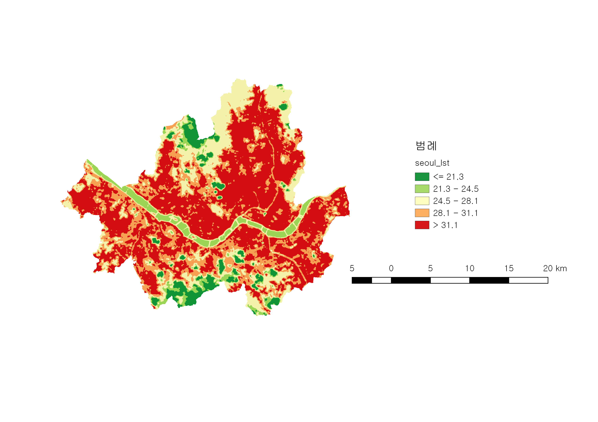
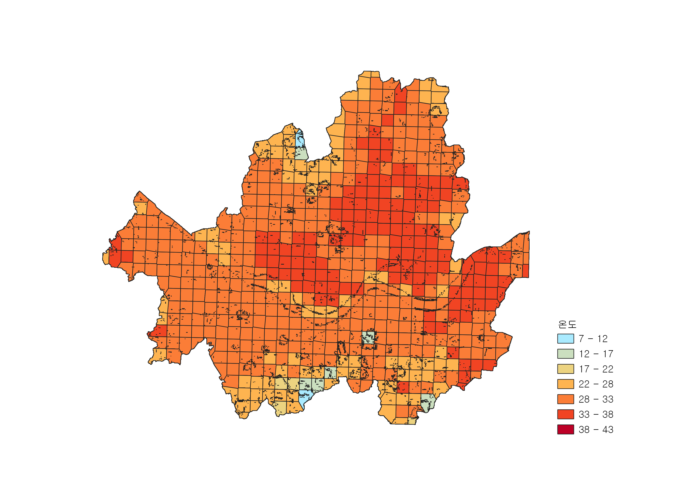
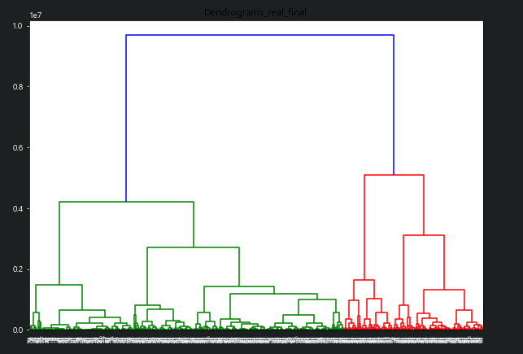
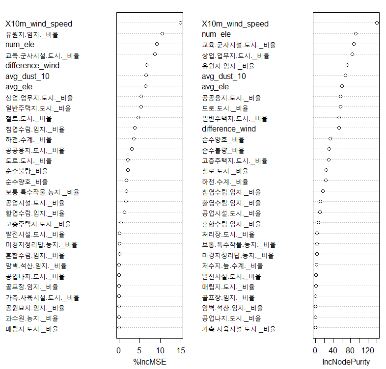
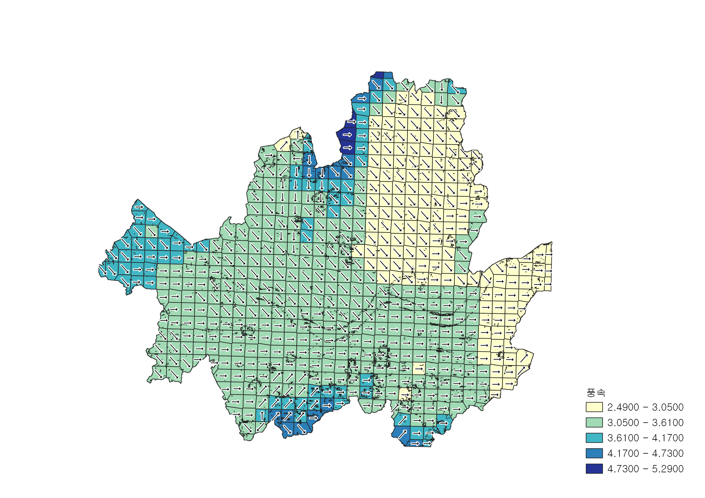
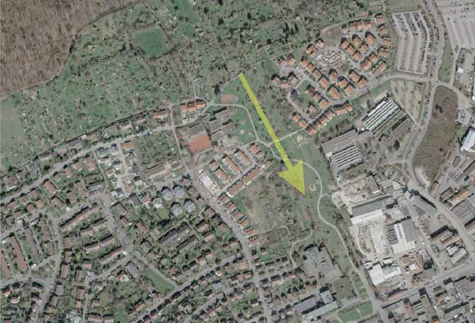

```{r setup, include=FALSE}
options(htmltools.dir.version = FALSE)
setwd("D:/workspace/ds_yonsei/project/final ppt")
```

```{r library, echo=FALSE, warning=FALSE, message=FALSE}
library(gridExtra)
library(tidyverse)
library(xaringan)
library(ggplot2)
library(gridExtra)
library(knitr)
library(ggmap)
library(sf)
library(leaflet)
library(DT)
```

```{r echo=FALSE, warning=FALSE, message=FALSE, results='hide'}
grid_sf <- st_read("grid/grid.shp")
heat_df <- read.csv('final.csv', encoding='CP949') # 최종
data <- read.csv('data.csv', header = TRUE) # 모든 변수 ... 원래 파일 이름: 최종본_추가
heat_index <- read_csv("heat.csv")
heat_island <- read.csv("heat_areas_factor.csv", header=TRUE)
colnames(heat_df)[5] <- "road_ratio" 

heat_sf <- grid_sf %>% left_join(heat_df, by = c("fid"="fid"))
heat_sf$label <- heat_sf$label %>% as.character() %>% as.factor()
```

# **목차  **
</br> 
##1. 문제 정의  

##2. 데이터 및 분석 도구

##3. 분석 결과

##4. 해결책 제시


---

#**1. 문제 정의**

## **도시 열섬 현상**
***

####- 주변의 비도시 지역에 비해 도시 지역의 온도가 높아지는 현상
####- 도시민의 건강 및 생활환경에 영향, 냉방에너지 수요 증가
####- 열섬 현상을 유발하는 도시적 환경을 교정할 필요


---

# **1. 문제 정의**
</br> 
## >> <u>바람길 조성</u>과 <u>녹지화</u>가 효과적인 해결책 (성선용 외,  2019)  
</br> 
#### 1) 바람길을 통해 도시 외부의 차고 신선한 공기 유입
#### 2) 녹지를 통해 태양열을  반사 
</br> 
#### +  바람길과 그린 인프라의 조합으로 미세먼지를 효과적으로 흡착, 순환
---
class: center, middle


### 열섬 현상을 효과적으로 해결할 수 있는

##**최적의 바람길 / 녹지 위치 선정!**

---

# **2. 데이터 및 분석 도구**

### **2-1. 사용한 데이터**
***
#### 1) **랜샛 위성  사진** : 지표면 온도 파악
#### 2) **미세먼지 데이터** : 입자 크기별 미세먼지 농도
#### 3) **풍속/풍향** : 지상 10m, 80m에서 연 평균 풍속/풍향 
#### 4) **토지피복** : 상업 업무지, 도로, 일반주택지, 인공녹지, 하천 등
#### 5) **고도** : 해발고도

</br> 
###### 데이터 출처: 서울 열린데이터 광장, 국가공간정보포털, 기상청, 기타 공공데이터 포털
---


# **2. 데이터 및 분석 도구**

### **2-2. 분석 도구**
***
###1) R, Python
###2) QGIS  
**: 데이터 뷰, 편집, 분석을 제공하는 <u>오픈소스</u> 데스크톱 지리 정보 체계 응용 프로그램**

---

# **3. 분석 결과 **

### 분석 흐름
***

### 1) 열섬현상(온도)의 지리적 분포 파악

### 2) 상관관계 분석을 통해 열섬현상에 영향을 미치는 변수 파악

### 3) 추려진 변수들을 통해 지역을 클러스터링

### 4) 열섬현상이 심한 지역에 대해 자세한 분석
</br> 
## >> *각 클러스터의 특성을 고려해 해결책 제시*  

---
# **3. 분석 결과 **

### 최종 변수  
***

####1. 온도(avg_tmp)  
####2. 풍속(X10m_wind_speed, X80m_wind_speed, difference_wind)  
####3. 토지피복도(녹지)
####4. 토지피복도(건물)
####5. 토지피복도(도로)
####6. 해발고도(avg_ele, num_ele)
####7. 토양 배수등급(양호비율, 불량비율)

---
# **3. 분석 결과 **
## **토지피복**
***
```{r land_var, echo=FALSE, warning=FALSE, message=FALSE}
colnames(data)[-c(2:4,34:51)]
```

---
# **3. 분석 결과 **
## **토지피복도(녹지)**
```{r g_var, echo=FALSE, warning=FALSE, message=FALSE}
colnames(data)[c(9,11,15,21,24,26,29)]
```
***
## **토지피복도(건물밀집도)**
```{r b_var, echo=FALSE, warning=FALSE, message=FALSE}
colnames(data)[c(5,7,8,13,14,19,22,30,33)]
```

---
# **3. 분석 결과**

## ** 온도(avg_tmp)**

***

###: 하나의 행정구 내에서도 온도에 큰 차이
### >> <u>573개의 그리드로 구분</u>하여 분석  

</br>  

온도(연속형)|온도(그리드)
----------|----------
<center></center>|<center></center>
---

# **3. 분석 결과**

## ** 고도 10m 풍속(10m_wind_speed)**
***
```{r wind, echo=FALSE, warning=FALSE, message=FALSE}
wind_bins <- c(2.2, 2.5, 2.7, 3.0, 3.5, 4, 5)
wind_pal  <- colorBin("Blues", domain = heat_sf$X10m_wind_speed , bins = wind_bins)
wind_labels <- sprintf(
  "<strong>cluster : %s</strong><br/> 10m wind speed : %g m/s <br/>80m wind speed : %g m/s <br/> wind speed difference : %g m/s <br/> average temperature : %g\u00B0C",
  heat_sf$label, heat_sf$X10m_wind_speed, heat_sf$X80m_wind_speed, heat_sf$difference_wind, heat_sf$avg_tmp 
) %>% lapply(htmltools::HTML)
leaflet(heat_sf) %>%
  addTiles() %>% 
  addPolygons(opacity = 1.0, fillOpacity = 0.8,
              weight = 1,
              fillColor = ~wind_pal(X10m_wind_speed),
              highlightOptions = highlightOptions(color = "black", weight = 3,  bringToFront = TRUE),
              label = wind_labels,
              labelOptions = labelOptions(
              style = list("font-weight" = "normal", padding = "3px 8px"),
              textsize = "15px",
              direction = "auto")) %>% 
    addLegend("bottomright", pal = wind_pal, values = ~X10m_wind_speed,
    title = "고도 10m에서의 풍속",
    labFormat = labelFormat(suffix = " m/s"),
    opacity = 1)
```

---

# **3. 분석 결과 **  

## **녹지(g_sum)**  
***
```{r land, echo=FALSE, warning=FALSE, message=FALSE}
green_bins <- c(0, 0.1, 0.5, 2, 10, 20, 50, 100)
green_pal  <- colorBin("Greens", domain = heat_sf$g_sum , bins = green_bins)
green_labels <- sprintf(
  "<strong>cluster : %s</strong><br/> green area ratio : %g percent <br/> average temperature : %g\u00B0C",
  heat_sf$label, heat_sf$g_sum, heat_sf$avg_tmp 
) %>% lapply(htmltools::HTML)
leaflet(heat_sf) %>%
  addTiles() %>% 
  addPolygons(opacity = 1.0, fillOpacity = 0.8,
              weight = 1,
              fillColor = ~green_pal(g_sum),
              highlightOptions = highlightOptions(color = "black", weight = 3,  bringToFront = TRUE),
              label = green_labels,
              labelOptions = labelOptions(
              style = list("font-weight" = "normal", padding = "3px 8px"),
              textsize = "15px",
              direction = "auto")) %>% 
    addLegend("bottomright", pal = green_pal, values = ~g_sum,
    title = "녹지 비율",
    labFormat = labelFormat(suffix = "percent"),
    opacity = 1)
```
---

# **3. 분석 결과 **  

## **도로(road_ratio)**  
***
```{r road, echo=FALSE, warning=FALSE, message=FALSE}
road_bins <- c(0, 30, 55, 75, 80, 85, 90, 100)
road_pal  <- colorBin("YlOrBr", domain = heat_sf$road_ratio, bins = road_bins)
road_labels <- sprintf(
  "<strong>cluster : %s</strong><br/> road ratio : %g <br/> average temperature : %g\u00B0C",
  heat_sf$label, heat_sf$road_ratio, heat_sf$avg_tmp 
) %>% lapply(htmltools::HTML)
leaflet(heat_sf) %>%
  addTiles() %>% 
  addPolygons(opacity = 1.0, fillOpacity = 0.8,
              weight = 1,
              fillColor = ~road_pal(road_ratio),
              highlightOptions = highlightOptions(color = "black", weight = 3,  bringToFront = TRUE),
              label = road_labels,
              labelOptions = labelOptions(
              style = list("font-weight" = "normal", padding = "3px 8px"),
              textsize = "15px",
              direction = "auto")) %>% 
    addLegend("bottomright", pal = road_pal, values = ~road_ratio,
    title = "도로 비율",
    labFormat = labelFormat(suffix = "(%)"),
    opacity = 1)
```
---

# **3. 분석 결과 **  

## **건물밀집도(b_sum)**  
***
```{r building, echo=FALSE, warning=FALSE, message=FALSE, fig.align='center'}
b_bins <- c(0, 1, 3, 5, 10, 15, 30, 55)
b_pal  <- colorBin("Greys", domain = heat_sf$b_sum , bins = b_bins)
## 라벨
b_labels <- sprintf(
  "<strong>cluster : %s</strong><br/> building area ratio : %g percent <br/> average temperature : %g\u00B0C",
  heat_sf$label, heat_sf$b_sum, heat_sf$avg_tmp 
) %>% lapply(htmltools::HTML)
leaflet(heat_sf) %>%
  addTiles() %>% 
  addPolygons(opacity = 1.0, fillOpacity = 0.8,
              weight = 1,
              fillColor = ~b_pal(b_sum),
              highlightOptions = highlightOptions(color = "black", weight = 3,  bringToFront = TRUE),
              label = b_labels,
              labelOptions = labelOptions(
              style = list("font-weight" = "normal", padding = "3px 8px"),
              textsize = "15px",
              direction = "auto")) %>% 
    addLegend("bottomright", pal = b_pal, values = ~b_sum,
    title = "건물 비율",
    labFormat = labelFormat(suffix = "percent"),
    opacity = 1)
```
---
# **3. 분석 결과**
## 클러스터링
***
<center></center>

---

# **3. 분석 결과 **

## 클러스터 분포
***

```{r 클러스터시각화코드, echo=FALSE, warning=FALSE, message=FALSE, fig.align='center'}
heat_sf %>% 
  group_by(label) %>% 
  select(label) %>% 
  plot(main="Clustering")
```

---

# **3. 분석 결과**

## 클러스터 간 차이 (평균 온도, 풍속)
***
```{r echo=FALSE, warnings=FALSE, message=FALSE, fig.align='center', fig.width=12}
tmp <- heat_sf[,c(1,2,33)]
tmp <- tmp %>% group_by(label) %>%
  summarize(avg_tmp=mean(avg_tmp,na.rm=T))

tmp$label <- factor(tmp$label)

barplot1 <- ggplot(tmp, aes(x=label, y=avg_tmp, fill=label)) +
  geom_bar(stat="identity") +
  scale_fill_manual(values = c("red", "green", "blue", "purple") ) +
  scale_fill_hue(c = 40) +
  ggtitle("평균 온도")

wind <- heat_sf[,c(1,23,33)]
wind <- wind %>% group_by(label) %>%
  summarize(wind=mean(X10m_wind_speed,na.rm=T))

wind$label <- factor(wind$label)

barplot2 <- ggplot(wind, aes(x=label, y=wind, fill=label)) +
  geom_bar(stat="identity") +
  scale_fill_manual(values = c("red", "green", "blue", "purple") ) +
  scale_fill_hue(c = 40) +
  ggtitle("풍속")

grid.arrange(barplot1, barplot2, nrow=1, ncol=2)
```

---

# **3. 분석 결과**

## 클러스터 간 차이 (건물밀집도, 녹지면적)
***
```{r echo=FALSE, warnings=FALSE, message=FALSE, fig.align='center', fig.width=12}
b_sum <- heat_sf[,c(1,33,34)]
building <- b_sum %>% group_by(label) %>%
  summarize(building=mean(b_sum,na.rm=T))

building$label <- factor(building$label)

barplot1 <- ggplot(building, aes(x=label, y=building, fill=label)) +
  geom_bar(stat="identity") +
  scale_fill_manual(values = c("red", "green", "blue", "purple") ) +
  scale_fill_hue(c = 40) +
  ggtitle("평균 건물밀집도")

g_sum <- heat_sf[,c(1,33,35)]
green_s <- g_sum %>% group_by(label) %>%
  summarize(green_area=mean(g_sum,na.rm=T))

green_s$label <- factor(green_s$label)

barplot2 <- ggplot(green_s, aes(x=label, y=green_area, fill=label)) +
  geom_bar(stat="identity") +
  scale_fill_manual(values = c("red", "green", "blue", "purple") ) +
  scale_fill_hue(c = 40) +
  ggtitle("평균 녹지면적")

grid.arrange(barplot1, barplot2, nrow=1, ncol=2)
```

---

# **3. 분석 결과**

## 클러스터 간 차이 (해발 평균, 하천 비율 평균)
***
```{r echo=FALSE, warnings=FALSE, message=FALSE, fig.align='center', fig.width=12}
ele <- heat_sf[,c(1,33,30)]
avg_ele <- ele %>% group_by(label) %>%
  summarize(avg_ele=mean(avg_ele,na.rm=T))

avg_ele$label <- factor(avg_ele$label)

barplot1 <- ggplot(avg_ele, aes(x=label, y=avg_ele, fill=label)) +
  geom_bar(stat="identity") +
  scale_fill_manual(values = c("red", "green", "blue", "purple") ) +
  scale_fill_hue(c = 40) +
  ggtitle("평균 해발고도")

water <- heat_sf[,c(1,33,7)]
water <- water %>% group_by(label) %>%
  summarize(avg_water=mean(하천.수계._비율,na.rm=T))

water$label <- factor(water$label)

barplot2 <- ggplot(water, aes(x=label, y=avg_water, fill=label)) +
  geom_bar(stat="identity") +
  scale_fill_manual(values = c("red", "green", "blue", "purple") ) +
  scale_fill_hue(c = 40) +
  ggtitle("평균 하천(수계) 비율")

grid.arrange(barplot1, barplot2, nrow=1, ncol=2)
```

---

# **3. 분석 결과**

## 클러스터 간 차이 (평균 토양 배수등급 불량 비율, 도로 비율)

```{r}

bad <- heat_sf[,c(1,33,21)]
bad <- bad %>% group_by(label) %>%
  summarize(avg_bad=mean(순수불량_비율,na.rm=T))

bad$label <- factor(bad$label)

barplot1 <- ggplot(bad, aes(x=label, y=avg_bad, fill=label)) +
  geom_bar(stat="identity") +
  scale_fill_manual(values = c("red", "green", "blue", "purple") ) +
  scale_fill_hue(c = 40) +
  ggtitle("평균 토양 배수등급 불량 비율")

road <- heat_sf[,c(1,33,5)]
road <- road %>% group_by(label) %>%
  summarize(avg_road=mean(road_ratio,na.rm=T))

road$label <- factor(road$label)

barplot2 <- ggplot(road, aes(x=label, y=avg_road, fill=label)) +
  geom_bar(stat="identity") +
  scale_fill_manual(values = c("red", "green", "blue", "purple") ) +
  scale_fill_hue(c = 40) +
  ggtitle("평균 도로 비율")

grid.arrange(barplot2, barplot1, nrow=1, ncol=2)
```

---
# **3. 분석 결과**

## 클러스터 간 차이 (해석)
***
### -클러스터 0 : 온도가 높은 **도심** 지역
건물 밀집도, 토양 배수등급 불량 등의 비율이 높음

### -클러스터 1 : 딱히 두드러진 특징이 보이지 않음 ...

### -클러스터 2 : 한강 주변 지역(하천의 영향)  

### -클러스터 3 : 고도가 높은 지역
해발고도가 높고 평균 녹지 면적이 넓음

### >> 도시적 특성과 열섬현상의 관계에 집중

---

# **3. 분석 결과 **

## 클러스터 분포
***

```{r 시각화, echo=FALSE, warning=FALSE, message=FALSE, fig.align='center'}
heat_sf %>% 
  group_by(label) %>% 
  select(label) %>% 
  plot(main="Clustering")
```

---


# **3. 분석 결과**
## 열섬지표  
***
###- 변수들을 0~1 사이로 스케일링하여 가중치 부여
- **cluster 0**에 속한 지역들을 대상으로 분석
- 랜덤 포레스트로 변수 중요도 추출
- 중복 변수 제거
- `%IncMSE`가 음수인 값들은 설명력을 떨어뜨리기 때문에 제거
- 가장 큰 값(X10m_wind_speed)으로 나눔
- 상관관계 부호에 따라 가중치 부여

---
# **3. 분석 결과**
## 열섬지표  
***
###- 변수들을 0~1 사이로 스케일링하여 가중치 부여

<center></center>

---
# **3. 분석 결과**
## 열섬지표  
***
###- 열섬지표가 높게 나타난 지역들을 중심으로 해결책 제시

###- 다른 지역들에 비해 열섬측도가 약 2배인 지역들 선정  
- 403(상계동 방학동 창동)
- 408(창동)
- 431(상계동)
- 381(번동 수유동 미아동)
- 300(둔촌동 길동 성내동)
---

# **3. 분석 결과**  

## 열섬지표  
***
```{r echo=FALSE, warnings=FALSE, message=FALSE, fig.width=12}
heat_index <- heat_index[,c(1,4)]
colnames(heat_index)[2] <- "index" 
heat_df <- left_join(heat_df, heat_index, by="fid")

heat_sf  <- grid_sf %>% left_join(heat_df, by = c("fid"="fid"))
heat_sf$label <- heat_sf$label %>% as.character() %>% as.factor()

index_pal  <- colorFactor(c("yellow","red"), domain = heat_sf$index)

index_labels <- sprintf(
  "<strong>cluster : %s</strong><br/> fid : %g <br/> average temperature : %g\u00B0C",
  heat_sf$label, heat_sf$fid, heat_sf$avg_tmp 
) %>% lapply(htmltools::HTML)

leaflet(heat_sf) %>%
  addTiles() %>% 
  addPolygons(opacity = 1.0, fillOpacity = 0.8,
              weight = 1,
              fillColor = ~index_pal(index),
              highlightOptions = highlightOptions(color = "black", weight = 3,  bringToFront = TRUE),
              label = index_labels,
              labelOptions = labelOptions(
              style = list("font-weight" = "normal", padding = "3px 8px"),
              textsize = "15px",
              direction = "auto")) %>%
    addLegend("bottomright", pal = index_pal, values = ~index,
    title = "열섬 측도",
    labFormat = labelFormat(suffix = "점"),
    opacity = 1)
```

---
# **3. 분석 결과**
## 열섬측도 상위 5개 지역의 특징
***
####1. fid 403, 408, 431  
- (실제 지도를 통해 본 결과) 철로, 도로, 공공용지, 공업시설, 교육군사시설이 큰 비중 차지  
- 창동 차량기지, 도봉 면허시험장 위치  

</br>  
  
####2.  fid 300, 381
- 도로, 상업 업무지역이 많고 일반 주택지가 큰 비중 차지  
- 미세먼지가 매우 높은 편

---

# **3. 분석 결과**

## 서울의 풍향/풍속 분포
***
<center></center>

---
# **3. 분석 결과**
## 열섬측도 상위 5개 지역의 특징
***
####1. fid 300:
- 강남구를 지나면서 풍속이 서서히 낮아지는 경향을 보임
- 강남구의 높은 건물들이 바람의 흐름을 막고 있다고 추측

####2. fid 403, 408, 431, 381:
- 북한산의 차가운 공기가 내려오지 못한다고 추측  

---
# **4. 해결책 제시**

##녹지화 방안
***
####>> 도로 비중이 높은 경우, 도로 주변에 녹지 조성 + 도로설계 내에서 중앙분리대 식수, 식수대 (Cha, H.-J., & Lim, J.-H. (2011).)

#### >> 건물 비중과 불투수토지의 비중이 높은 경우 나무를 심기 어려움 > 옥상녹화의 효율 (김예슬, 이빛나라, 이은희. (2014).)

---

# **4. 해결책 제시**

##녹지 입지 제안
***
###- 열섬 측도가 높은 지역에 도시숲 및 식수대(도로 양옆 가로수길)조성
###- 건물 밀집도와 배수등급이 불량인 지역에 옥상정원 조성
```{r}
DT::datatable(heat_island)
```

---

# **4. 해결책 제시**

##독일 슈투트가르트의 **바람길** 계획 사례  
***
- 주변 산지에서 생성되는 차고 신선한 바람이 유입되도록 광역종합계획과 세부 지침을 수립

- 시간당 1억 9000㎥의 신선한 공기 도시 내로 유입

<center></center>

---

# **4. 해결책 제시 **

## 바람길 입지 제안 
***
- 북한산으로부터 내려오는 찬 공기를 효과적으로 끌어들일 필요

- 키 큰 나무를 밀도 있게 심어 신선하고 차가운 공기가 고이는 공기 댐을 만들고 강한 공기의 흐름을 확산

```{r echo=FALSE, warnings=FALSE, message=FALSE, fig.align='center'}
register_google(key='###########')
# 악용의 우려가 있어 구글 API 키를 제거했습니다.

gc <- geocode(enc2utf8("노원구")) %>%
  as.numeric()
map =  get_googlemap(center=gc,
                     zoom=12,
                     size=c(400,400),
                     maptype='terrain')

ggmap(map)
```

---

# **4. 해결책 제시**

## 서울의 풍향/풍속 분포
***
#### >> 북서풍과 서풍 방향으로 바람길 조성  
<center></center>

---

##참고문헌  
***
- 성선용, 박종순, 이상은, 김선희. (2019). 미세먼지 저감을 위한 도시 내 바람길 도입 방안. 국토정책 Brief, (), 1-6.  
  
- 김용진, 강동화, 안건혁. (2019). 기후변화에 따른 도시열섬현상 특성 변화와 도시설 계적 대안 모색에 관한 기초연구. 한국도시설계학회지 도시설계, 12(3), 5-14.
  
- 김수봉, 정응호, 김용범. (2004). 도시열섬현상 완화를 위한 대구시 바람길 도입 및 조성방안에 관한 연구. 환경과학논집, 9, 143-156.

- 김예슬, 이빛나라, 이은희. (2014). 제3분과 : 하천 및 도시녹지 ; 관리조방형 옥상녹화 적용 초화류의 온도저감 효과.  한국환경생태학회 학술발표논문집, 2014(1), 62-63.

- Cha, H.-J., & Lim, J.-H. (2011). The Effect of Urban Road Vegetation on a Decrease of Road Surface Temperature.  Journal of the Korean Institute of Landscape Architecture, 39(3), 107–116. 