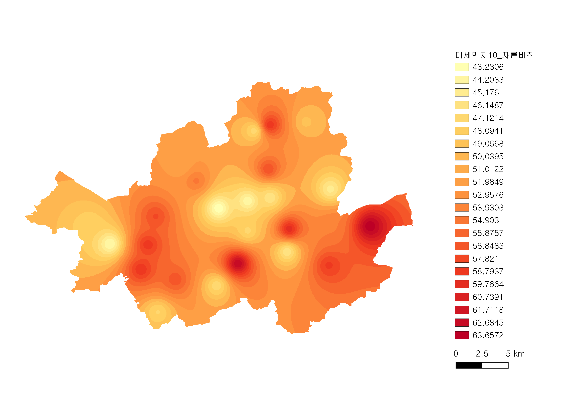
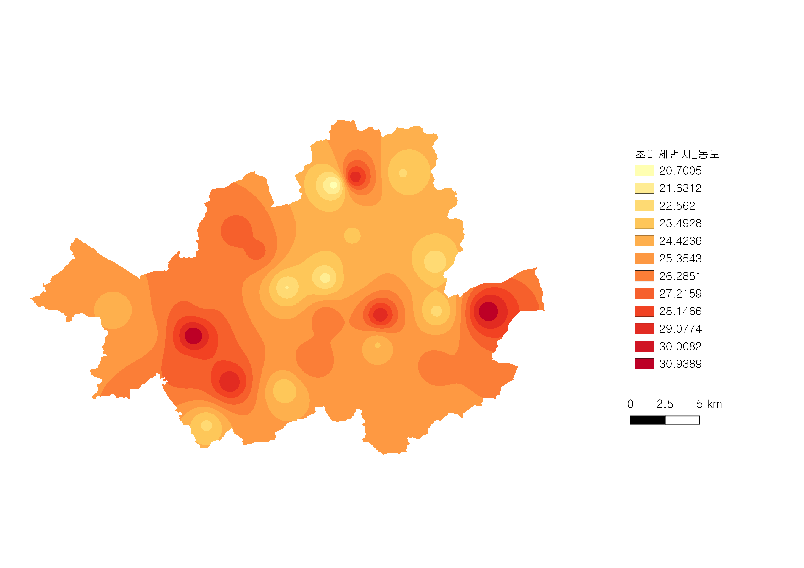
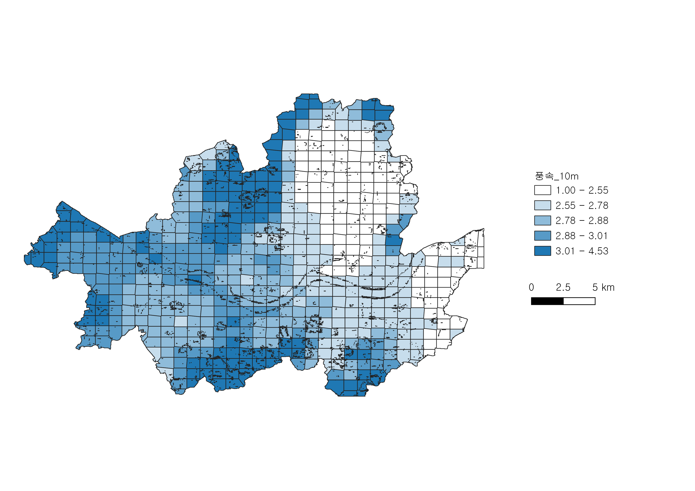
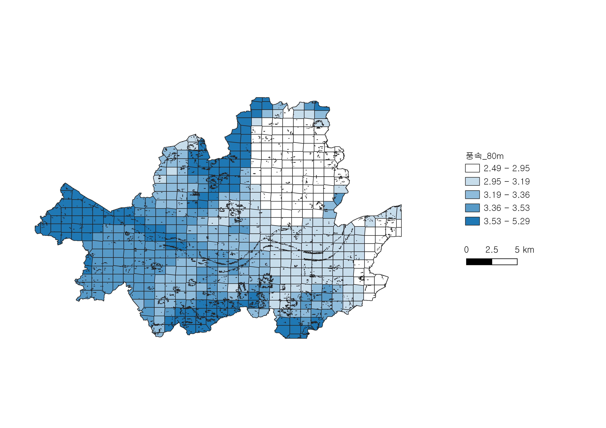
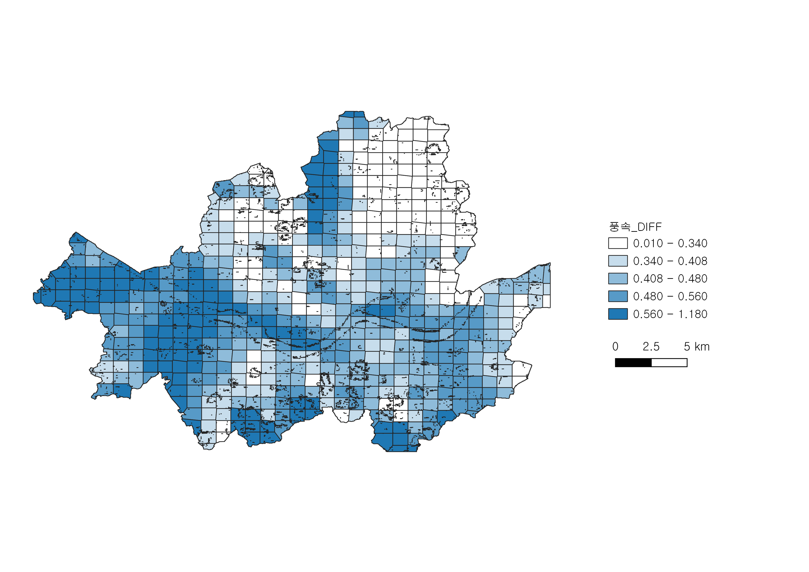

```{r setup, include=FALSE}
options(htmltools.dir.version = FALSE)
# setwd("D://workspace//ds_yonsei//project//ppt")
```

```{r library, echo=FALSE, warning=FALSE, message=FALSE}
library(tidyverse)
library(xaringan)
library(ggplot2)
library(knitr)
```

# **목차  **

##1. 문제 정의  

##2. 데이터 및 분석 도구

##3. 분석 과정

##4. 분석 결과 및 해결책 제시


---

#**1. 문제 정의**

## **열섬 현상과 미세먼지가 심각한 사회 문제로 대두**


###1) 도시 열섬 현상  
- 열섬 현상: 비도시 지역에 비해 도시 지역의 온도가 높아지는 현상  
- 여름철 폭염과 열대야로 인한 피해
- 열섬 현상을 유발하는 도시적 특성들을 교정할 필요

###2) 미세먼지

- 미세먼지로 인한 심장 질환 및 폐 질환 사례 증가  
- 미세먼지 완화를 위한 해결책 제시


## >> <u>바람길 조성</u>과 <u>녹지화</u>가 효과적인 해결책 (성선용 외,  2019)  

---
class: center, middle


### 열섬현상과 미세먼지를 효과적으로 해결할 수 있는

##**최적의 바람길 / 녹지 위치 선정!**

---

### **위치 선정을 위해 고려할 요소들**  

###1) 온도 / 미세먼지
여름/겨울철 최저/평균/최고 온도와 미세먼지 농도 분석
###2) 풍속과 풍향
바람과의 상관관계 분석을 통한 바람길 입지 선정
###3) 토지피복
온도 및 미세먼지의 증가와 관련있는 변수 선정
###4) 고도

###5) 토양배수등급

---

# **2. 데이터 및 분석 도구**
###- **랜샛 위성  사진** : 지표면 온도 파악
###- **풍속/풍향** : 지상 10m, 80m에서 연 평균 풍속/풍향 
###- **토지피복** : 상업 업무지, 도로, 일반주택지, 인공녹지, 하천 등
###- **고도** : 해발고도
###- **토양배수등급** : 6개의 범주
###- **서울시 경계 파일**

###- 미세먼지는 어떤 식으로 구하셨는지요 !
###- 여기서 더 빠진 파일들이 있을까용 ...?

---


# **2. 데이터 및 분석 도구**
## **분석도구**
- R, Python
- QGIS
: 데이터 뷰, 편집, 분석을 제공하는 오픈소스 데스크톱 지리 정보 체계 응용 프로그램
  
  
  
  
## **데이터 출처**
- 서울 열린데이터 광장  
- 국가공간정보포털  
- 기상청  
- 기타 공공데이터

---

# **3. 분석 과정 **
  
### **온도**
: 하나의 구 내에서도 온도 및 미세먼지 농도에 큰 차이가 있어 573개의 그리드로 구분하여 분석

<center></center>

---

# **3. 분석 과정 **
## **미세먼지**

<center></center>

---

# **3. 분석 과정 **
## **미세먼지**

<center></center>

---

# **3. 분석 과정**
## **풍향**

<center></center>

---

# **3. 분석 과정**
## **풍향**

<center></center>

---

# **3. 분석 과정**
## **풍향**

<center></center>

---

# **3. 분석 과정**

```{r include=FALSE}
library(tidyverse)
library(ggplot2)
library(scales)

angle = 22.25

wind = read_csv("wind.csv") %>%
  mutate(풍향 = ifelse((Annual_WD>angle)&(Annual_WD<3*angle), "북동풍",
                     ifelse((Annual_WD > 3*angle)&(Annual_WD < 5*angle), "동풍",
                            ifelse((Annual_WD > 5*angle)&(Annual_WD < 7*angle), "남동풍",
                                   ifelse((Annual_WD > 7*angle)&(Annual_WD < 9*angle), "남풍",
                                          ifelse((Annual_WD > 9*angle)&(Annual_WD < 11*angle), "남서풍",
                                                 ifelse((Annual_WD > 11*angle)&(Annual_WD < 13*angle), "서풍",
                                                        ifelse((Annual_WD > 13*angle)&(Annual_WD < 15*angle), "북서풍", '북풍')))))))) %>%
  mutate(풍속 = ifelse(Annual_WS<3, "0~3m/s",
                     ifelse((Annual_WS > 3)&(Annual_WS < 4), "3~4m/s",
                            ifelse((Annual_WS > 4)&(Annual_WS < 5), "4~5m/s",
                                   ifelse(Annual_WS > 5 & Annual_WS < 6, "5~6m/s",
                                          ifelse(Annual_WS > 6, "6m/s이상", "기타")))))) %>%
  mutate(풍향기호 = ifelse(풍향=='북풍', "↓",
                       ifelse(풍향=='북동풍', "↙",
                              ifelse(풍향=='동풍', "←",
                                     ifelse(풍향=='남동풍', "↖",
                                            ifelse(풍향=='남풍', "↑",
                                                   ifelse(풍향=='남서풍',"↗",
                                                          ifelse(풍향=='서풍', "→", "↘"))))))))

  
wind$WS = factor(wind$풍속, levels=c('6m/s이상', '5~6m/s','4~5m/s', '3~4m/s', '0~3m/s', '기타'), ordered=T)
wind$WD = factor(wind$풍향, levels=c('북풍', '북동풍', '동풍', '남동풍', '남풍', '남서풍', '서풍', '북서풍'), ordered=T)
```

## **풍향**
**: 서풍, 북서풍이 가장 큰 비중을 차지**

```{r echo=FALSE}
ggplot(wind, aes(x=WD, fill=wind$WS)) +
  geom_bar(width=1, colour='black') +
  scale_fill_brewer(palette='YlGnBu', direction=-1) +
  coord_polar(start=5.89)
```

---

# **3. 분석 과정 **
## **토지피복**

---

# **3. 분석 과정 **
## **고도**

---

# **4. 분석 결과**

## **녹지**  


***
  
### **바람길**


---
##참고문헌  

- 성선용, 박종순, 이상은, 김선희. (2019). 미세먼지 저감을 위한 도시 내 바람길 도입 방안. 국토정책 Brief, (), 1-6.  
  
- 김용진, 강동화, 안건혁. (2019). 기후변화에 따른 도시열섬현상 특성 변화와 도시설 계적 대안 모색에 관한 기초연구. 한국도시설계학회지 도시설계, 12(3), 5-14.
  
- 김수봉, 정응호, 김용범. (2004). 도시열섬현상 완화를 위한 대구시 바람길 도입 및 조성방안에 관한 연구. 환경과학논집, 9, 143-156.

---